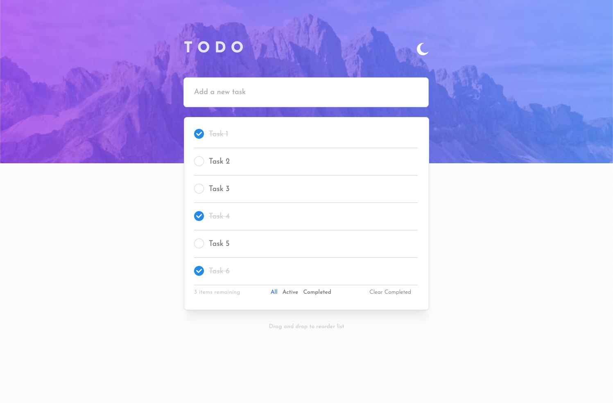
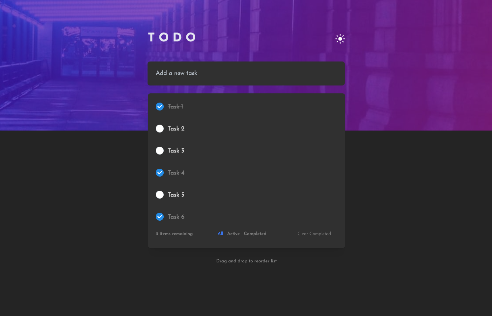

### Objective

Your challenge is to build out this full-stack todo app and get it looking as close to the design as possible.

### Brief

Using any language or framework (our team mostly works in React and Python/Flask), your task is to build out the project to the designs inside the `/design` folder. The designs are in JPG static format. This will mean that you'll need to use your best judgment for styles such as `font-size`, `padding` and `margin`. There is also a `style-guide.md` file, which contains the information you'll need, such as color palette and fonts.

**Client Side**

Your users should be able to:

- Add new todos to the list
- Mark todos as complete
- Delete todos from the list
- Filter by all/active/complete todos
- Clear all completed todos
- See hover states for all interactive elements on the page

**Server Side**

- Design a simple API for persisting state on the server side
- Implement routes for all listed **CRUD** operations
- **No authentication / session management is required.** Imagine you're building this application for a single user (yourself)

### Evaluation Criteria

- Show us your work through your commit history
- We're looking for you to produce working code, with enough room to demonstrate how to structure components in a small program
- **Testing:** is the system adequately tested? **Please write at least one unit test.**
- **Completeness:** did you complete the features?
- **Correctness:** does the functionality act in sensible, thought-out ways?
- **Maintainability:** is it written in a clean, maintainable way?

### The App

  

  

### Potential Future Improvements

- Store filtered state in localStorage to preserve view on browser refresh
- Fix styling to cleanly auto-adjust when fully collapsing browser window vertically & horizontally
- Minor mobile styling issues
  - 'Active/Completed' filtered elements table is slightly wider than when 'All' filter is applied
  - Fix styling in landscape mode (input field overlapping with table)
  - Double tap required to complete a Task (iPhone)
  - Toggling away from browser auto-refreshes page (iPhone)
- Consider converting styling to CSS Grid?

### Tech Stack

- React
- Typescript
- Mantine
- hello-pangea/dnd (fork of react-beautiful-dnd)
- Jest
- Python
- Django REST Framework
- Pylint
- Mypy
- Unittest
- PostgreSQL
